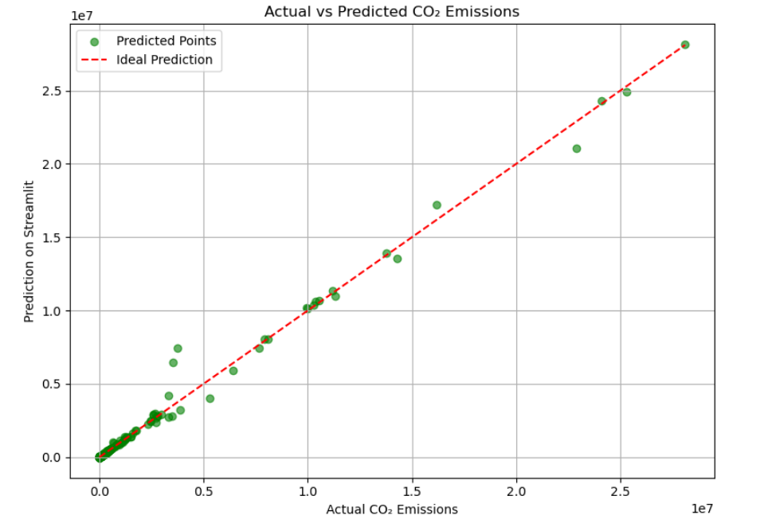

  <h1>🌍 Carbon Emission Prediction 🧐</h1>
  
It is a machine learning project to predict total CO₂ emissions using global environmental and economic indicators.

  

    <h2>📁 Project Structure</h2>
    <pre>
carbon-emission-prediction/
├── Cleaned_data/               # Cleaned data
├── Analysis.ipynb              # EDA and modeling notebooks
├── RandomForest_Model.ipyb     # Model training script
├── streamlit_app.py            # Interactive UI
├── carbon_model.pkl            # Saved model (.pkl)
├── requirements.txt            # Dependencies
└── README.md                   # This project page
    </pre>
  

  

    <h2>✅ Step 1: Data Cleaning</h2>
    <ul>
      <li>Converting data into numerical form</li>
      <li>Renaming inconsistent columns</li>
      <li>Transforming and standardizing DataFrames</li>
      <li>Cleaning null/missing values</li>
      <li>Filtering countries with excessive missing data</li>
      <li>Dropping columns with too many NaNs</li>
    </ul>
  

  

    <h2>📊 Step 2: Data Analysis</h2>
    <ul>
      <li>Used <strong>Seaborn</strong> for correlation heatmaps and pair plots</li>
      <li>Used <strong>Matplotlib</strong> for emission trends and actual vs predicted plots</li>
    </ul>
  

  

    <h2>🔮 Step 3: Emission Prediction</h2>
    <ul>
      <li><strong>Model Used:</strong> RandomForestRegressor</li>
      <li><strong>Input Features:</strong> Year, GDP, Energy Use per Capita, Population, Urban Population</li>
      <li><strong>Target:</strong> Total CO₂ Emission (metric tons)</li>
      <li><strong>Accuracy:</strong> 93.8%</li>
    </ul>
  

  

    <h3>📸 Streamlit Project Demo</h3>
    <a href="https://carbon-emission-prediction-by-shr.streamlit.app/">CARBON EMISSION PREDICTION</a>
    <h2>💻 Setup Instructions</h2>
    <ol>
      <li>Clone the repository:
        <pre><code>git clone https://github.com/SHRISTI-125/Carbon-Emission-Predication</code></pre>
      </li>
      <li>Create a virtual environment (optional):
        <pre><code>python -m venv venv source venv/bin/activate</code></pre>
      </li>
      <li>Install dependencies:
        <pre><code>pip install -r requirements.txt</code></pre>
      </li>
      <li>Train the model:
        <pre><code>python RandomForest_Model.py</code></pre>
      </li>
      <li>Launch the Streamlit app:
        <pre><code>streamlit run app.py</code></pre>
      </li>
    </ol>
  

  

    <h2>⚙️ Requirements</h2>
    <ul>
      <li>pandas</li>
      <li>numpy</li>
      <li>scikit-learn</li>
      <li>matplotlib</li>
      <li>seaborn</li>
      <li>streamlit</li>
    </ul>
  

  

    <h2>📈 Example Output</h2>
    
  

  

    <h2>📂 Dataset Source</h2>
    
Get the data here <a href="https://github.com/SHRISTI-125/Carbon-Emission-Predication/blob/main/Cleaned_data.csv">data</a>

  

  

    <h2>🔗 GitHub Repository</h2>
    
👉<a href="https://github.com/SHRISTI-125/Carbon-Emission-Predication" target="_blank"> View Project on GitHub</a>

  

  

    <h2>✍️ Author : Shristi Kumari</h2>
  

</body>
</html>

